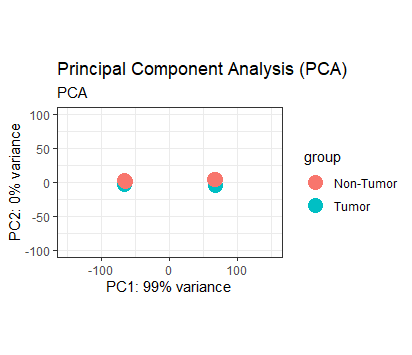
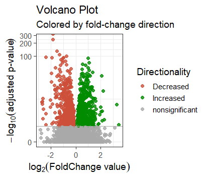
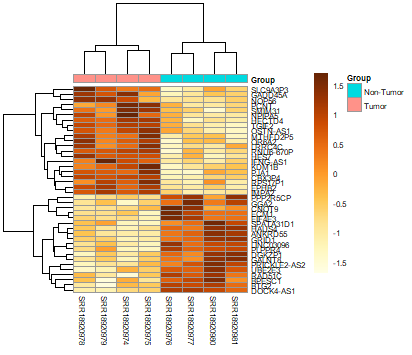
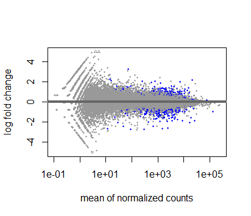
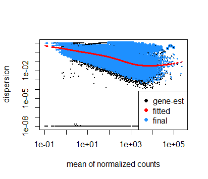

# Differential_Gene_Expression_Analysis
To identify differentially expressed genes in the uterine leiomyosarcoma samples across tumor vs non-tumor conditions.

The datasets for this analysis were sourced from the study titled **["Transcriptome Analysis for miR-10b-5p Transfected Leiomyosarcoma Cells"](https://www.ncbi.nlm.nih.gov/pmc/articles/PMC10073409)** with the accession number [GSE201542](https://www.ncbi.nlm.nih.gov/geo/query/acc.cgi?acc=GSE201542) in the Gene Expression Omnibus (GEO) database.

## INTRODUCTION
Uterine leiomyosarcoma is a rare and aggressive tumor originating from smooth muscle cells of the myometrium. It represents a malignant counterpart to the benign leiomyoma. Understanding the differential gene expression in these tumors can provide insights into their underlying mechanisms and identify potential biomarkers or therapeutic targets. This analysis focuses on assessing the impact of miR-10b-5p transfection on gene expression in uterine leiomyosarcoma cells.

## WORKFLOW
1. **Data Retrieval**
   - **Source**: The European Nucleotide Archive (ENA) provided the annotated sequences and associated experimental metadata used in this analysis.

2. **Quality Control and Data Preprocessing**
   - **FASTQC**: Sequencing read quality was assessed to identify potential issues such as sequencing errors and adapter contamination. The overall quality metrics were satisfactory, with a high percentage of reads meeting quality thresholds.
   - **Trimmomatic**: Adapter sequences and low-quality bases were trimmed to ensure clean and high-quality data for downstream analysis.

3. **Alignment**
   - **BWA**: The Burrows-Wheeler Transform (BWA) algorithm was used for aligning RNA sequencing reads to the reference genome. This approach ensured accurate and efficient alignment, crucial for reliable downstream analysis.

4. **Quantification**
   - **FeatureCounts**: Reads were assigned to genomic features (e.g., genes) and counted to estimate transcript abundance. This step involved normalization to account for differences in sequencing depth across samples.
     
5. **Differential Expression Analysis**
   - **DESeq2**: Differential gene expression was analyzed using DESeq2, an R package that employs a negative binomial distribution to identify genes with significant expression changes between tumor and non-tumor conditions.
     
## RESULTS
The analysis identified several genes that are differentially expressed between tumor and non-tumor conditions.

1. **Principal Component Analysis (PCA) Plot**: It is used to visualize the overall structure of the data and to explore relationships between samples. In this plot:
- The x-axis and y-axis represent the first and second principal components, respectively. These components capture the largest variances in the dataset.
- Points on the plot represent individual samples (tumor and non-tumor).
- The plot helps to identify clusters or patterns in the data, showing how samples group together based on their expression profiles. Samples that are closer together in the plot have similar expression patterns.
  

2. **Volcano Plot**: It is a type of scatter plot used to visualize the results of differential expression analysis. In this plot:
- The x-axis represents the log2 fold change (how much the expression of a gene has increased or decreased).
- The y-axis represents the negative log10 of the p-value (a measure of the statistical significance of the observed change).
- Points farthest from the center (both up and down) indicate the most differentially expressed genes.

3. **Heatmap**: It displays the expression levels of the most significantly differentially expressed genes across all samples. It shows:
- Rows represent genes.
- Columns represent individual samples (tumor and non-tumor).
- Colors indicate the expression levels, with typically red for high expression and blue for low expression.

4. **MA plot**: It is a scatter plot used to visualize differences between measurements taken in two samples:
- The x-axis shows the average expression of a gene.
- The y-axis shows the log2 fold change.
- This plot helps identify genes with large fold changes that are statistically significant.

5. **Dispersion Plot**: It is used in DESeq2 to show how much the expression of genes varies between samples. It is used to assess the model's fit to the data and helps in understanding the variability of gene expression.

## INTERPRETATION

☝️ **Upregulated genes**: These genes are potentially involved in processes that promote tumor growth or survival, making them candidates for further investigation as potential biomarkers or therapeutic targets. The top 10 upregulated genes are listed below:

| Gene        | Base Mean  | Log2 Fold Change | lfcSE        | Stat        | p-value  | adjusted p-value |
|-------------|------------|------------------|--------------|-------------|----------|------------------|
| PCNT        | 11.81      | 3.43             | 1.11         | 3.08        | 0.0021   | 0.0296           |
| PHF10       | 72.00      | 3.29             | 0.57         | 5.77        | 7.93E-09 | 4.31E-07         |
| NPIPA5      | 14.62      | 2.28             | 0.62         | 3.68        | 0.0002   | 0.0047           |
| TMEM184C    | 21265.21   | 2.20             | 0.26         | 8.51        | 1.80E-17 | 2.25E-15         |
| LRRC4C      | 15.58      | 2.12             | 0.60         | 3.56        | 0.0004   | 0.0070           |
| TDRD12      | 252.01     | 2.11             | 0.44         | 4.83        | 1.36E-06 | 5.11E-05         |
| ZNF114-AS1  | 790.01     | 2.06             | 0.16         | 12.82       | 1.34E-37 | 5.93E-35         |
| ZNF570      | 6970.55    | 2.03             | 0.43         | 4.71        | 2.53E-06 | 8.88E-05         |
| P2RX4       | 550.51     | 1.97             | 0.37         | 5.38        | 7.51E-08 | 3.45E-06         |

👇 **Downregulated genes**: These genes might play roles in normal cellular functions that are suppressed in tumor cells, potentially acting as tumor suppressors. The top 10 downregulated genes are listed below:

| Gene        | Base Mean | Log2 Fold Change | lfcSE        | Stat          | p-value   | Adjusted p-value |
|-------------|-----------|------------------|--------------|---------------|-----------|------------------|
| ANKRD55     | 155.30    | -2.74            | 0.44         | -6.26         | 3.87E-10  | 2.47E-08         |
| GRID1       | 296.49    | -2.68            | 0.42         | -6.36         | 2.05E-10  | 1.36E-08         |
| HAUS4       | 88.10     | -2.68            | 0.46         | -5.86         | 4.75E-09  | 2.68E-07         |
| DGKZP1      | 11.28     | -2.65            | 0.70         | -3.78         | 0.0002    | 0.0034           |
| SPATA17     | 1441.12   | -2.64            | 0.38         | -6.89         | 5.70E-12  | 4.50E-10         |
| STAC        | 2418.68   | -2.60            | 0.51         | -5.07         | 3.89E-07  | 1.58E-05         |
| RPSAP21     | 666.68    | -2.42            | 0.12         | -21.01        | 5.49E-98  | 1.54E-94         |
| RORA-AS1    | 932.26    | -2.41            | 0.79         | -3.04         | 0.0023    | 0.0329           |
| GALNT8      | 46.38     | -2.39            | 0.54         | -4.41         | 1.01E-05  | 0.0003           |
|LINC03096	  |28.65	     |-2.04             |	0.38        |	-5.35        |	8.41E-08	 | 3.85E-06         |

## CONCLUSION

- This differential gene expression analysis provides valuable insights into the molecular alterations associated with uterine leiomyosarcoma.
- The identified upregulated and downregulated genes offer potential targets for further investigation as biomarkers or therapeutic interventions.
- Future studies should validate these findings and explore their functional implications in tumor biology.
